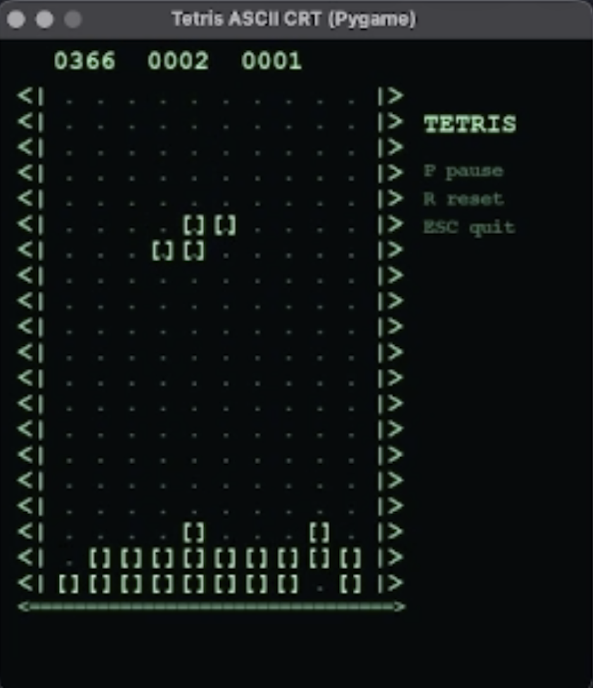

<h1 align="center">🟩 Tetris Terminal</h1>

<p align="center">
Pequeño Tetris en Python ejecutado desde terminal
</p>

<p align="center">
  
</p>

---

## Requisitos

- Python 3
- pygame

## Comandos

```bash
python3 tetris_pygame.py
